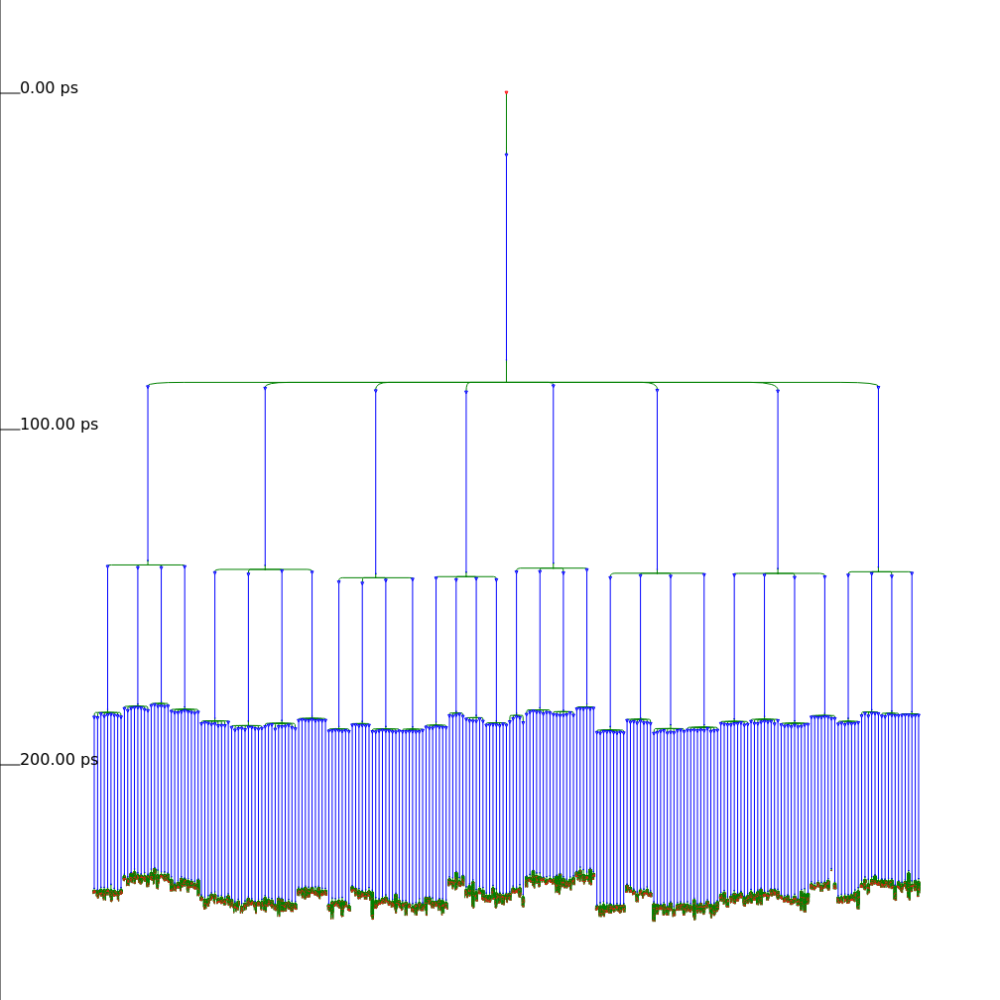
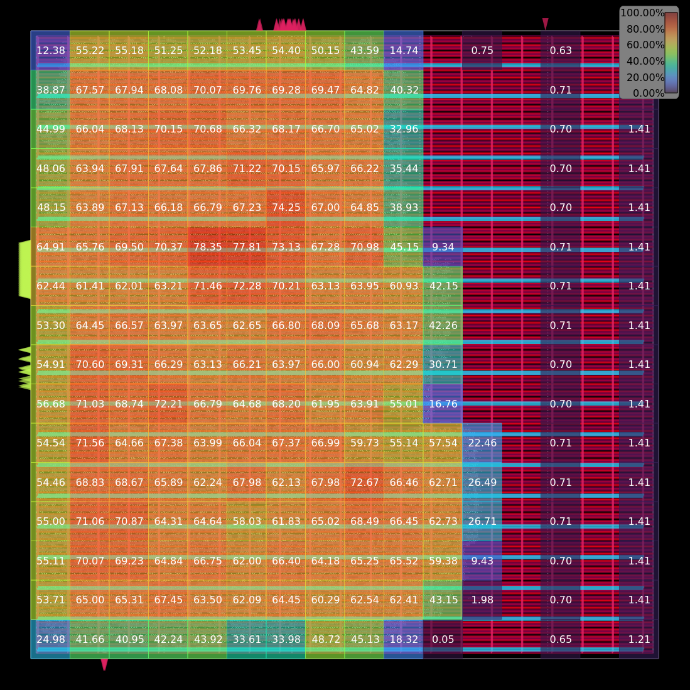

<p align="center">
  <picture>
    <source media="(prefers-color-scheme: dark)" srcset="images/chisel-boom-logo-dark.png">
    <source media="(prefers-color-scheme: light)" srcset="images/chisel-boom-logo-light.png">
    
  </picture>
</p>

<div align="center">

[](https://www.scala-lang.org/)
[](https://www.chisel-lang.org/)
[](https://github.com/RayZh-hs/chisel-boom/actions/workflows/ci.yml)

</div>

This repository contains a simplified chisel implementation of an Out-of-Order processor, inspired by the **Berkeley Out-of-Order Machine (BOOM)**.

## 📢 Features

The project implements the following key features:
- Full support for the **RISC-V RV32I** instruction set architecture.
- Out-of-Order execution with dynamic scheduling and RAT.
- (WIP) Multi-layer branch prediction to minimize control hazards.

We synthesized the chip using Silicon Compiler, obtaining a max clock frequency of 0.47GHz. Below are sample visualizations from the synthesis process.

| Clock Distribution | Placement Density |
| :---: | :---: |
|  |  |

## 🚀 Getting Started

This project uses the **Mill** build tool.

### Prerequisites

- **JDK 11+**
- **Mill**
- **Verilator** (for simulation)
- **RV32I Toolchain** (for simulation)
- **Silicon Compiler** (for synthesis)

For quick script execution, we recommend using [Mango](https://github.com/Mango-CLI/Mango) since this repo comes with a Mango shorthand suite.

### Running Tests

You can run tests using:

```bash
mango test
mango test e2e
mango test unit
```

Alternatively, to run the full test suite (Unit tests + End-to-End tests) do:

```bash
mill test
```

### Simulation

You can run the chiselsim-based simulator with Verilator backend using:

```bash
mango simulate <testcase-name>
```

This will output the hex dump and the path to the log file. You can find the set of available test cases in `test/e2e-tests/resources/c`.

To compile a single `.c` file and run it on the simulator, use:

```bash
mill test.runMain e2e.RunCFile test/e2e-tests/resources/c/add_to_100.c
```

Pass in `--verbose` for detailed printf output during the simulation process.

### Elaboration

If your sole purpose is synthesize, you may leave out the path to hex file and an empty memory will be used.

Using Mango:

```bash
mango elaborate (<path-to-hex-file>)
```

Using mill:

```bash
mill runMain VerilogEmission (<path-to-hex-file>)
```

The system verilog generated will be located in `synthesis/output/`.

### Synthesis

To run synthesis using Silicon Compiler, configure the apptainer path in `.env`(see `.env.example`).

Using Mango:
```bash
mango synthesize
```

Manually:
```
source .env
apptainer exec --bind .:/workspace "$SILICON_COMPILER_APPTAINER_PATH" python3 /workspace/synthesis/Synthesize.py
```

## 🏗 Architecture Overview

The core (`src/core/BoomCore.scala`) connects the following major subsystems:

### Frontend (`src/components/frontend`)
Responsible for feeding instructions to the pipeline.
*   **InstFetcher**: Fetches instructions from memory.
*   **InstDecoder**: Decodes raw bits into control signals.
*   **InstDispatcher**: Dispatches decoded instructions to the backend.
*   **BranchPredictor**: Predicts control flow to minimize stalls.

### Backend (`src/components/backend`)
Manages the out-of-order execution window.
*   **ReOrderBuffer (ROB)**: Ensures instructions commit in-order to maintain precise exceptions.
*   **Adaptors**: Interface layers for execution units (ALUAdaptor, BRUAdaptor, etc.).

### Structures (`src/components/structures`)
The functional blocks providing validity to the architecture.
*   **RegisterAliasTable (RAT)**: Maps architectural registers to physical registers (Renaming).
*   **FreeList**: Manages available physical registers.
*   **IssueBuffers**: Holds instructions until their operands are ready.
*   **Functional Units**: `ArithmeticLogicUnit` (ALU), `BranchUnit`, `LoadStoreUnit`.
*   **PhysicalRegisterFile**: The simplified unified generic register file.

## 📂 Project Structure

```text
.
├── src/
│   ├── common/          # Shared Bundles, Constants, and Enums
│   ├── components/      # Hardware logic modules separated by stage
│   │   ├── frontend/    # Fetch & Decode logic
│   │   ├── backend/     # Commit & Dispatch logic, Adaptors
│   │   └── structures/  # State-holding elements (RAT, ROB, IssueQueues)
│   ├── core/            # Top-level wiring (BoomCore)
│   └── utility/         # Helper utils (CycleAwareModule, etc.)
├── synthesis/           # Verilog generation scripts
├── test/                # Unit tests and E2E system tests
└── docs/                # Detailed documentation files
```
